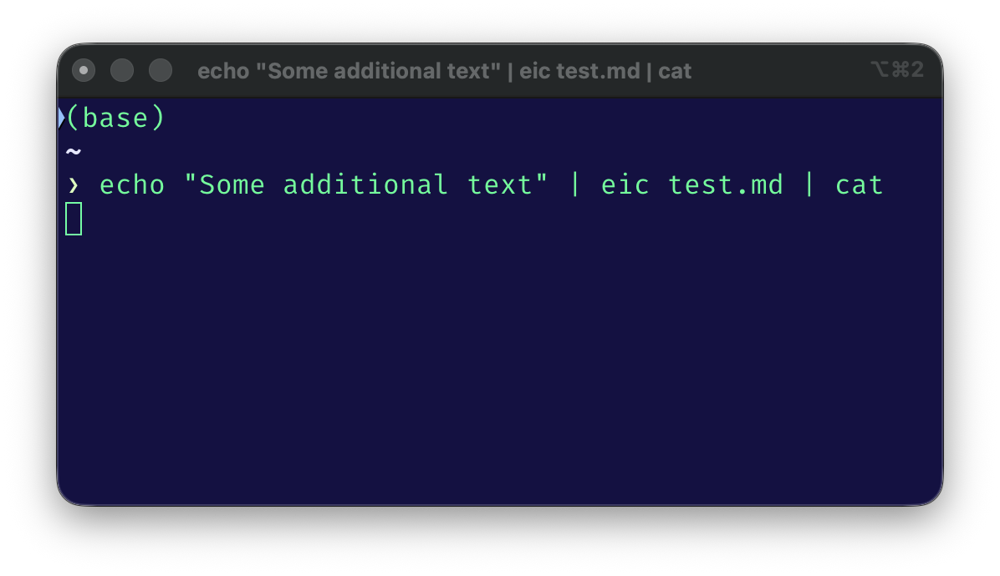
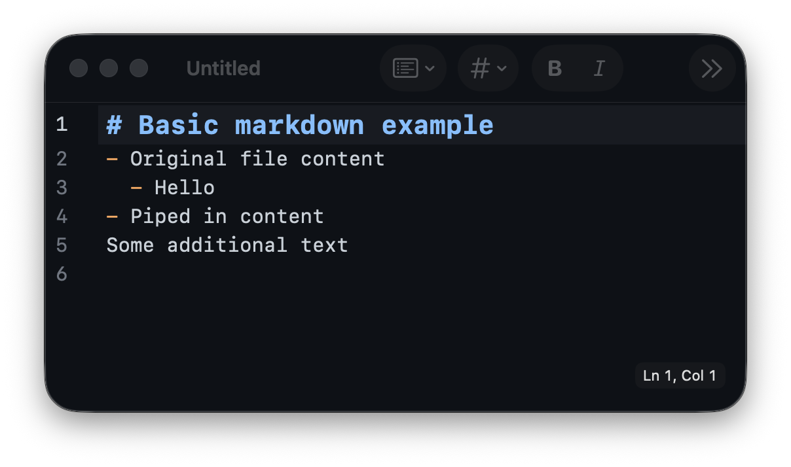
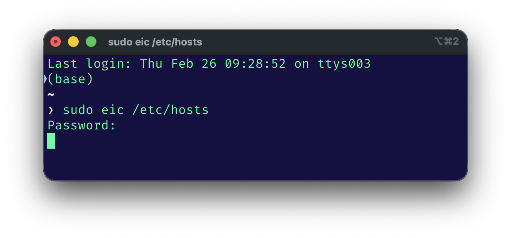
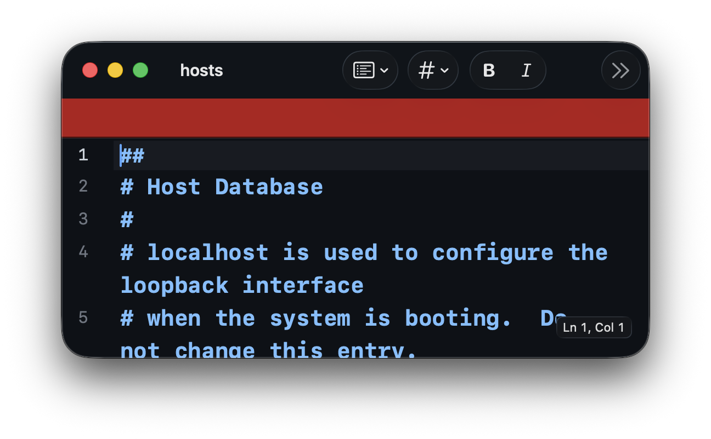

<picture>
  <source media="(prefers-color-scheme: light)" srcset="./Icon.png" width="128">
  <source media="(prefers-color-scheme: dark)" srcset="./Icon-dark.png" width="128">
  
</picture>

# MarkEdit InContext

[](https://github.com/wundram/MarkEdit-InContext)

A CLI-launched, in-context Markdown editor for macOS, forked from [MarkEdit](https://github.com/MarkEdit-app/MarkEdit).

Edit text in context — in the middle of a pipe chain, as a git editor, or as a quick-edit tool. The CLI command `eic` (Edit In Context) opens a native editor window, blocks the terminal until you save or discard, and optionally pipes content through stdin/stdout.

## Why this exists

Terminal workflows increasingly need human-in-the-loop editing — reviewing a generated commit message, tweaking prompt text before it's sent, fixing a config file, editing a comment before it's posted. These are small, contextual edits that happen in the middle of a pipeline, not inside a project.

The default tool for this is usually a vi/vim variant, which is a poor fit for casual editing. Full editors like VS Code work, but they open into their own file/folder context — confusing when the file you're editing is a temp file with a random name in `/tmp`. And editing directly in the terminal with readline is fragile: limited to a single line, no easy way to review surrounding context, and one accidental Enter keypress can submit half-written text.

This last point is especially painful in AI agentic workflows. Tools like [Claude Code](https://docs.anthropic.com/en/docs/claude-code), [Kiro](https://kiro.dev), and similar AI agent CLIs frequently ask you to review or compose multi-line text — commit messages, prompts, configuration fragments — in a context where the terminal's readline is the only input. You end up wishing you could just pop open a real editor, write your text with proper editing controls, and hand it back to the pipeline.

MarkEdit InContext fills this gap: a native macOS editor that opens fast, blocks the calling process, integrates with pipes and git, and gets out of the way when you're done. It's designed for the edit-and-return pattern, not for project management.

## How it works

The app runs as a persistent background server. The `eic` CLI is a lightweight gRPC client that sends content to the app and blocks until the user saves or discards. This means the editor window opens instantly — no app launch delay after the first invocation.

- **Save and Exit** (`Cmd+S`) — writes content back and unblocks the CLI (exit 0)
- **Discard** (`Cmd+W`) — closes the window and unblocks the CLI (exit 1)
- **Quit** (`Cmd+Q`) — quits the app, discarding all open sessions

## How it differs from MarkEdit

MarkEdit InContext strips MarkEdit down to a single-purpose tool: edit one file at a time, launched from the terminal.

- **Single-file, CLI-launched** — `eic <file>` opens the file in a native editor window
- **Blocking by default** — the terminal waits until you save or discard
- **Pipe-aware** — reads from stdin, writes to stdout, works in pipe chains
- **Git-ready** — `GIT_EDITOR=eic` works out of the box with auto-detected titles
- **No autosave** — your file is never written to disk until you explicitly save
- **No tabs, no recent documents, no Dock menu**
- **Same editor core** — CodeMirror 6, themes, syntax highlighting, completions, and all editor settings

## Installation

### Homebrew (recommended)

```sh
brew install --no-quarantine wundram/tap/markedit-in-context
```

The `--no-quarantine` flag skips Gatekeeper since the app is ad-hoc signed (see [Gatekeeper note](#gatekeeper) below).

### Manual

1. Download `MarkEdit-InContext-<version>.zip` from the [latest release](https://github.com/wundram/MarkEdit-InContext/releases/latest)
2. Unzip and move `MarkEdit InContext.app` to `/Applications`
3. Copy `Tools/eic` to somewhere on your `$PATH` (e.g. `/usr/local/bin/eic`)
4. Allow the app in **System Settings > Privacy & Security** on first launch

## Gatekeeper

MarkEdit InContext is ad-hoc signed (`CODE_SIGN_IDENTITY = -`), which means macOS Gatekeeper will block it on first launch. To allow it:

1. Try to open the app — macOS will show a warning
2. Go to **System Settings > Privacy & Security**
3. Click **Open Anyway** next to the MarkEdit InContext message

With Homebrew, `--no-quarantine` skips this entirely.

## Usage

### Basic editing

```sh
# Edit a file (blocks until save or discard)
eic file.md

# Create and edit a new file
eic newfile.md

# Edit a system file with sudo
sudo eic /etc/hosts

# Open settings
eic --settings
```

### Piping

```sh
# Stdin to editor, save outputs to stdout
echo "draft text" | eic

# Append stdin to an existing file, edit, save back to file
echo "extra content" | eic notes.md

# Edit a file, pipe saved content to next command
eic draft.md | wc -w

# Edit without modifying the original, output to stdout
eic --no-save file.md

# Full pipeline
curl -s api/data | eic | jq .
```

<p>
  
  
</p>

### In a `sudo` command

Since the eic client handles all file i/o operations, it can edit files with root when run inside a sudo command.

<p>
  
  
</p>

### As your $EDITOR

The `$EDITOR` environment variable is the standard Unix mechanism for programs to open a text editor. Setting it to `eic` gives you a native editor window anywhere a program would normally drop you into vim or nano.

```sh
# Set for the current shell
export EDITOR=eic

# Or add to your ~/.zshrc
eval "$(eic --env)"   # exports both EDITOR and GIT_EDITOR
```

With `$EDITOR` set:

- **Zsh line editing** — press `Ctrl+X Ctrl+E` (or `Ctrl+G` with vi mode) to edit the current command line in a full editor window, then save to execute it
- **`crontab -e`**, **`visudo`**, **`kubectl edit`** — any Unix tool that invokes `$EDITOR` will open MarkEdit InContext instead of vi

### Git integration

```sh
# Use as git editor (auto-detects commit/rebase/merge/tag titles)
GIT_EDITOR=eic git commit
GIT_EDITOR=eic git rebase -i HEAD~3

# Or set globally
git config --global core.editor eic
```

The window title automatically detects the git context — "Git Commit", "Git Rebase", "Git Merge", "Git Tag" — so you always know what you're editing.

### AI agent CLIs

AI agentic CLI tools need a way to let you compose or review multi-line text — prompts, commit messages, configuration fragments — during an interactive session. These tools typically use `$EDITOR` for this.

```sh
# Claude Code will use eic for text editing
export EDITOR=eic

# Works with any AI CLI that respects $EDITOR
```

This is where `eic` particularly shines. Editing a multi-line prompt or reviewing generated text in a real editor with syntax highlighting, undo, and cursor navigation is a fundamentally better experience than wrestling with readline in a terminal. The edit-and-return pattern — open, edit, save, continue — maps perfectly to the human-in-the-loop workflow these tools need.

### Window title

```sh
# Set a custom window title
eic --title "Release Notes" changelog.md

# Auto-title from filename
eic config.yaml              # title: "config.yaml"

# Auto-title from stdin
echo "text" | eic            # title: "stdin"

# Auto-title from git context
GIT_EDITOR=eic git commit    # title: "Git Commit"
```

### Non-blocking mode

```sh
# Open and return immediately (fire-and-forget)
eic --detach file.md
```

### CLI reference

```
USAGE: eic [--title <title>] [--verbose] [--version] [--no-save] [--detach]
           [--settings] [--env] [--quit] [<file>]

ARGUMENTS:
  <file>                  File to edit

OPTIONS:
  --title <title>         Set the window title
  -v, --verbose           Show debug output on stderr
  --version               Show version information
  --no-save               Edit a copy; on save, output to stdout (original unchanged)
  --detach                Open and return immediately (don't block)
  --settings              Open the settings panel
  --env                   Print EDITOR/GIT_EDITOR exports
  --quit                  Quit the running app
  -h, --help              Show help information.
```

## Acknowledgments

Built on [CodeMirror 6](https://codemirror.net/). Forked from [MarkEdit](https://github.com/MarkEdit-app/MarkEdit) by [@wundram](https://github.com/wundram).
